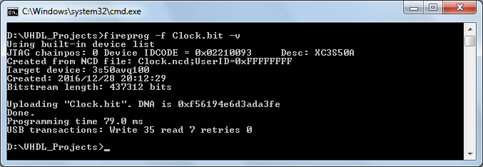
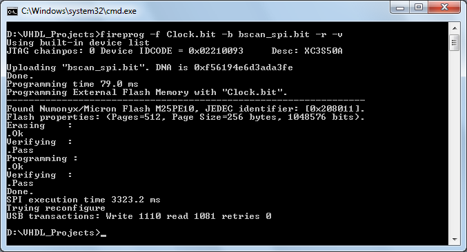

# fireprog: a Xilinx Spartan 3 configuration software
Fireprog is a utility which can program Xilinx Spartan 3 FPGAs via FT232H-based USB-to-JTAG adapter.
It is based on fpgaprog and Papilio-Prog, to which support for Micron M25PE10 SPI flash was added.
Fireprog is used to configure Prometheus FPGA boards.

Copyleft (C) Altynbek Isabekov, Onurhan Öztürk
License:  GNU General Public License v2

## Compilation on Linux

To compile on Linux, run:
	make clean
	make
The resulting ELF binary "fireprog" will be linked with libusb and libftdi.

## Cross-compilation on Linux for Windows

In order to cross-compile on Linux for Windows using MinGW, firstly download the "CDM v2.12.24 WHQL Certified.zip" driver 
from http://www.ftdichip.com/Drivers/D2XX.htm and unzip it into "libftd2xx" folder, which is at the same hierarchy level as "fireprog".

	├── fireprog
	│   ├── bitfile.cpp
	│   ├── bitfile.h
	│   │...
	│   ├── tools.cpp
	│   └── tools.h
	│
	├── libftd2xx
	│   ├── amd64
	│   ├── ftd2xx.h
	│   ├── ftdibus.cat
	│   ├── ftdibus.inf
	│   ├── ftdiport.cat
	│   ├── ftdiport.inf
	│   ├── i386
	└── └── Static

The linker will use "../libftd2xx" folder (see the Make files). Modify the Make files to change the cross-compiler location (default is /usr/bin/i686-w64-mingw32-*).

After unzipping the libftd2xx driver, you can cross-compile on Linux for Windows (yields fireprog.exe, which is a PE32 or PE32+ executable).
Depending on the architecture and linking type, one of the following commands should be executed:

	make -f Makefile.MinGW32Static clean
	make -f Makefile.MinGW32Static

	make -f Makefile.MinGW32Dynamic clean
	make -f Makefile.MinGW32Dynamic

	make -f Makefile.MinGW64Static clean
	make -f Makefile.MinGW64Static

	make -f Makefile.MinGW64Dynamic clean
	make -f Makefile.MinGW64Dynamic

Dynamically linked executables require some libraries from the MinGW cross-compiler. Putting these libraries in the same folder where fireprog.exe resides, allows execution without errors:

	fireprog-win32-dynamic
	├── fireprog.exe
	├── libgcc_s_sjlj-1.dll
	├── libstdc++-6.dll
	└── libwinpthread-1.dll

	fireprog-win64-dynamic
	├── fireprog.exe
	├── libgcc_s_seh-1.dll
	├── libstdc++-6.dll
	└── libwinpthread-1.dll

## Usage

In order to program the Prometheus board, plug it in the USB port, Windows OS should recognize it as a USB-to-Serial (RS232) converter and associate it with the libftd2xx driver.
Now you can run fireprog.exe from the command line and supply the configuration bit-file.

Configuring FPGA with a bit-stream Circuit.bit:

    ./fireprog -v -f Circuit.bit

Configuring SPI Flash memory with a bit-stream Circuit.bit (mediator bscan_spi.bit is required):

    ./fireprog -v -f Circuit.bit -b bscan_spi.bit -r

The last switch "-r" triggers reconfiguration of the FPGA.

On Windows, command options are exactly the same:

